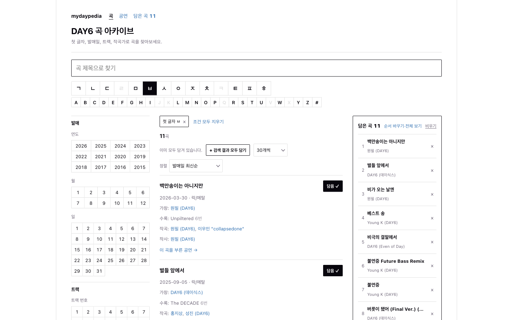
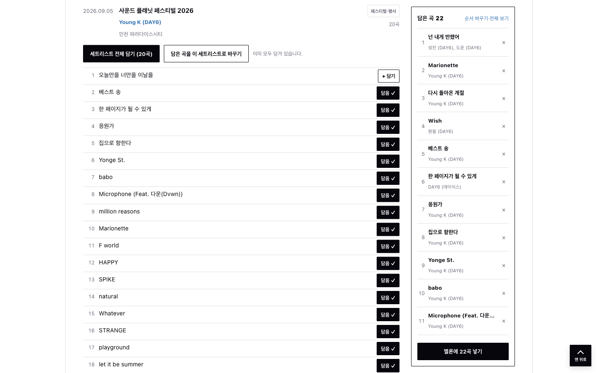
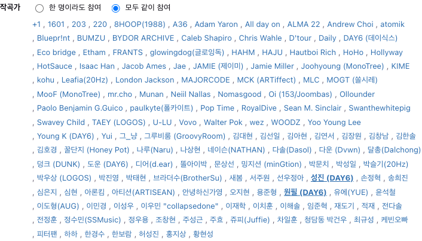

# AI 활용 포트폴리오

서버 개발 7년차(PHP 기반 B2C 서비스) 백엔드 개발자 백록담입니다.
Claude Code로 Java Spring Boot 풀스택 서비스를 만들면서 AI를 어떻게 지시하고, 어디서 틀렸고, 어떻게 검증했는지를 정리했습니다.

| 안내 항목 | 이 문서의 위치 |
|---|---|
| 6. AI를 활용한 프로토타입 제작 | [1. 반나절 만에 만든 풀스택 프로토타입](#1-반나절-만에-만든-풀스택-프로토타입) |
| 3. AI 초안 vs 본인이 수정한 최종 산출물 | [2. AI 초안과 최종 설계](#2-ai-초안과-최종-설계) |
| 5. AI의 한계를 겪고 해결한 경험 | [3. AI의 한계와 대응](#3-ai의-한계와-대응) |
| 4. AI를 개발 워크플로에 통합한 사례 | [4. 개발 워크플로에 AI 통합](#4-개발-워크플로에-ai-통합) |
| 2. 실제 사용한 프롬프트 | [5. 프롬프트 개선 과정](#5-프롬프트-개선-과정) |

---

## 프로젝트: mydaypedia

밴드 DAY6의 곡, 공연, 세트리스트를 검색하고, 고른 곡을 담아 멜론 재생목록으로 넘기는 개인용 아카이브 서비스입니다.

- **Backend**: https://github.com/rokdam/mydaypedia-backend
- **Frontend**: https://github.com/rokdam/mydaypedia-frontend
- **Infra** (Docker Compose, Jenkinsfile, Prometheus/Grafana, Elasticsearch 설정): https://github.com/rokdam/mydaypedia-infra
- **실행 방법**: 각 저장소 README 참고 (Docker로 MySQL, Redis를 띄운 뒤 `./gradlew bootRun`, `npm run dev`)

| 영역 | 기술 |
|---|---|
| Backend | Java 21, Spring Boot 4, Spring Data JPA (Specification), Swagger(springdoc) |
| Frontend | React 19, TypeScript, Vite |
| Data | MySQL, Redis (관리자 토큰 저장) |
| Infra | Docker Compose, Jenkins, Prometheus + Grafana, Elasticsearch + Kibana + Filebeat |
| AI | Claude Code (설계 상담, 코드 작성, 브라우저 검증, 보안 점검) |

| 규모 | 수치 |
|---|---|
| 백엔드 | Java 파일 93개, 약 3,700줄, API 39개, 엔티티 12개 |
| 프론트엔드 | 소스 파일 46개, 약 4,700줄 |
| 데이터 | 곡 238개, 앨범 31개 이상, 작곡가·작사가 141명, 공연 회차 312개, 세트리스트 곡 1,189건 |
| 작업 기간 | 2026-09-22, 09-28, 10-01 (작업일 기준 3일) |



### 기여도

| 작업 | 본인 | Claude Code |
|---|---|---|
| 서비스 기획, 요구사항 정의 | 100% | |
| 도메인 모델 결정 (작곡가 N:M, 그룹 크레딧, 조합 검색 규칙) | 결정 100% | 대안 비교와 제안 |
| 코드 작성 (백엔드, 프론트엔드, 인프라 설정) | 리뷰, 수정 지시 | 작성 약 95% |
| 데이터 검수 (동일 인물, 잘못 수집된 행 판별) | 도메인 판단 100% | 정합성 검사 스크립트 |
| 검증 (빌드, 테스트, API, 브라우저 확인) | 결과 확인 | 실행 |

데이터는 벅스, 나무위키 등 공개 웹 정보를 개인 학습 목적으로 수집했습니다. 수집 스크립트와 수집 데이터는 저장소에 포함하지 않았습니다.

---

## 1. 반나절 만에 만든 풀스택 프로토타입

> 안내 항목 6: AI를 활용한 프로토타입 제작 사례

### 진행

첫날(09-22) 약 4시간 20분 동안 인프라 뼈대부터 검색 화면까지 만들었습니다. 아래는 실제로 입력한 지시를 시간순으로 줄인 것입니다.

| 시각 (KST) | 지시 | 결과 |
|---|---|---|
| 12:32 | 사용할 기술 스택을 Claude가 한 번에 인식하기 좋게 디렉토리와 문서를 구성할 수 있는지 | 루트, backend, frontend별 `CLAUDE.md` 계층 구조 제안 |
| 12:35 ~ 13:02 | Spring 초기 세팅, Dockerfile, Jenkins 파이프라인, React 세팅, Prometheus/Grafana, Elasticsearch 로그 수집 | 저장소 3개(backend, frontend, infra)와 Docker Compose 구성 |
| 13:55 ~ 14:52 | API 구현, 패키지 구조 검토, 검색 조건 확장, 작곡가 N:M 구조 | 곡 검색 API (조건 10여 개) |
| 14:52 ~ 16:48 | 검색 UI, 참고 서비스 조사 후 Discogs 스타일로 화면 개편 | 프론트엔드 검색 화면 |

### AI에게 맡긴 것과 직접 한 것

- **AI**: 프로젝트 뼈대, 설정 파일, 엔티티와 API 코드, 화면 코드, 빌드와 API 호출 검증
- **본인**: 무엇을 만들지와 순서 결정, AI가 낸 설계안 채택 여부 판단, 도메인 규칙 정의 (예: "작곡가는 여러 명이다", "검색은 키워드가 아니라 저장된 사람을 클릭하는 방식이다")

이후 이틀(09-28, 10-01)은 실제 데이터를 넣으며 기능을 다듬었습니다. 공연 세트리스트 검색, 곡 담기(장바구니), 멜론 재생목록 연결, 관리자 페이지, GitHub 공개 전 보안 점검까지 진행했습니다.



---

## 2. AI 초안과 최종 설계

> 안내 항목 3: AI로 생성한 초기 산출물 vs 본인이 수정한 최종 산출물

### 사례 1. 작곡가를 문자열 한 칸에 저장한 초안

**지시**: "월별, 연도별, 작곡가별, 작사가별, 피처링, OST 여부, 장르별로 검색이 가능한 구조여야 해"

**AI 초안**: `Song` 엔티티에 `composer`, `lyricist` 문자열 컬럼을 추가하고 부분일치로 검색했습니다.

```java
// AI 초안 (요약)
private String composer;   // "홍지상, 성진, 원필"
private String lyricist;
// 검색: composer LIKE '%성진%'
```

**문제점**

1. 작곡은 보통 여러 명이 함께 합니다. 한 칸에 문자열로 넣으면 "성진"으로 검색했을 때 "허성진"도 걸립니다.
2. 같은 사람이 표기만 다르게 들어가도 막을 방법이 없습니다.
3. 원하는 검색 방식은 키워드 입력이 아니라 이미 저장된 사람을 클릭하는 방식이었습니다.

**수정 지시**: "작곡가나 작사가는 보통 여럿이서 작업해서 여러 명이 저장되어야 하고, 검색 시에 키워드보다는 이미 저장된 데이터를 클릭해서 검색하는 방식으로 생각하고 있어"

**최종 구조**: 작곡가·작사가를 별도 도메인 `Songwriter`로 분리하고, 역할(작곡, 작사)을 가진 N:M 조인 엔티티로 연결했습니다. 검색은 id로 합니다.

```
songs ──< song_writer_credits >── songwriters
           (role: COMPOSER | LYRICIST)
GET /api/songs?composerIds=16,13&composerMatch=ALL
```

이 구조 덕분에 이후 "그룹 크레딧은 멤버 검색에도 나오게", "두 멤버가 같이 작곡한 곡만" 같은 요구를 컬럼 변경 없이 쿼리 조건 추가로 해결했습니다.

### 사례 2. AI가 검증 중에 스스로 찾은 버그

N:M 구조로 바꾼 직후, AI가 실제 MySQL에 데이터를 넣어 시나리오를 검증하다가 버그를 발견했습니다.

**AI 초안**: 크레딧 수정 시 기존 크레딧을 전부 지우고 새로 추가

**증상**: 작곡가 2명 중 1명만 바꿨는데, 바뀌지 않은 크레딧까지 유니크 제약 위반(409)이 발생

**원인**: Hibernate는 같은 flush 안에서 INSERT를 DELETE보다 먼저 실행합니다. 아직 지워지지 않은 기존 행과, 내용이 같은 새 행이 충돌했습니다.

**최종**: 실제로 바뀐 크레딧만 지우고 추가하는 diff 방식(`replaceCreditsForRole`)으로 변경하고, 이 내용을 `backend/CLAUDE.md`에 기록했습니다. 이후 곡-앨범 연결에도 같은 방식을 적용했습니다.

### 사례 3. 내 제안을 AI가 반대한 경우

**지시**: "디렉토리 구조가 song / playlists로 되어 있는데 컨트롤러/서비스/Repository별로 나누는 게 좋지 않을까? 어떤 게 좋은지 파악하고 더 맞는 쪽으로 진행시키고 설명해줘"

**AI 답변**: 도메인별 구조를 유지해야 한다고 반대했습니다. 근거는 응집도, 앞으로 늘어날 도메인 수, package-private으로 경계를 강제할 수 있다는 점이었습니다.

**판단**: 근거를 검토한 뒤 AI 의견을 채택했습니다. 이후 도메인이 8개(song, album, artist, songwriter, concert, playlist, admin, common)로 늘어났지만 구조를 바꿀 필요가 없었습니다. AI가 맞장구만 치지 않도록 "더 맞는 쪽으로 진행하고 설명해줘"처럼 판단 근거를 요구하는 방식으로 지시했습니다.



---

## 3. AI의 한계와 대응

> 안내 항목 5: AI의 한계를 겪고 해결한 경험

### 3-1. 도메인 지식이 없어서 같은 사람을 다른 사람으로 저장

**문제**: 벅스에서 크레딧을 수집하자 같은 사람이 여러 명으로 저장됐습니다. `박성진`(본명)과 `성진 (DAY6)`, `Kang Young Hyun`과 `Young K (DAY6)`, 띄어쓰기나 따옴표만 다른 `이우민 "collapsedone"` 변형 4개 등입니다. 본명과 활동명이 같은 사람이라는 사실은 AI가 데이터만 보고 알 수 없었습니다.

**대응**

1. 본명과 활동명 관계는 제가 알려 주었습니다.
2. AI는 별칭 목록(`SONGWRITER_ALIASES`)과 병합 스크립트를 만들었습니다. 기본 실행은 합칠 대상만 보여 주는 dry-run이고, `--apply`를 붙여야 한 트랜잭션으로 반영합니다.
3. 반영 전후로 사람별 크레딧 합계가 같은지, 가리키는 사람이 없는 크레딧이 0건인지 검사했습니다.
4. 수집 스크립트도 별칭을 참조하게 바꿔서, 다시 수집해도 중복이 생기지 않게 했습니다.

**AI의 판단을 다시 확인한 지점**

- AI는 제가 알려 준 2건 외에 `강영현`, `윤도운`도 같은 경우라고 보고 함께 합친 뒤 "잘못 합친 거라면 알려 달라"고 보고했습니다. 맞는 판단이었지만, AI가 추론으로 데이터를 바꾼 부분은 제가 다시 확인했습니다.
- 반대로 `허성진`은 다른 작곡가라며 합치지 않았습니다.
- `Jae 박성진`처럼 두 사람 이름이 쉼표 없이 붙은 표기는 AI가 임의로 처리하지 않고 저에게 물었습니다.

**결과**: 작곡가·작사가 149명이 141명으로 정리됐고, 크레딧 유실은 0건이었습니다.

### 3-2. 요약 도구를 거치면 데이터가 빠지거나 바뀔 위험

**문제**: 웹 페이지 내용을 AI 요약 도구로 가져오면 항목이 빠지거나 잘못 적힐 수 있습니다. 31개 앨범, 238곡을 하나씩 눈으로 대조할 수는 없었습니다.

**대응**

- 요약을 쓰지 않고 원본 HTML을 파싱하는 스크립트를 만들게 했습니다.
- 스크립트를 두 번 돌려 새로 생기는 행이 0건인지 확인했습니다. 같은 입력에 같은 결과가 나오는지 보는 방식입니다.
- 화면에 없는 정보(두 번째 이후 가수, 피처링으로만 참여한 곡 16개)는 AI가 수집 결과 수를 보고 누락을 의심해 찾아냈습니다.

### 3-3. 수집 원본의 잡음이 데이터로 들어감

**문제**: 나무위키 공연 표의 비고 칸("현장 스케치 비하인드 영상", "MD 메이킹" 등) 54건이 공연 메모로 들어갔고, 세트리스트에는 곡이 아닌 VCR, MENT 같은 행 284건이 함께 들어갔습니다. AI는 표에 있는 것을 모두 데이터로 보았습니다.

**대응**: 어떤 칸이 의미 있는 데이터인지는 제가 정했습니다. 기존 행을 지우는 데서 끝내지 않고 수집 단계에서 차단했습니다. 세트리스트는 행만 지우면 순서 번호가 비기 때문에, AI가 교체 API로 곡 항목만 다시 저장해 순서를 1부터 다시 매기는 방법을 제안했습니다.

### 3-4. AI가 원인을 직접 확인할 수 없는 버그

**문제**: "선택 박스를 누르면 이상한 곳에서 떠"라고 보고했는데, AI의 브라우저 도구로는 macOS 기본 메뉴를 캡처할 수 없어 재현이 되지 않았습니다.

**대응**: AI는 원인을 "macOS는 기본 선택 박스를 열 때 선택된 항목이 박스 위치에 오도록 메뉴를 띄운다"로 추정했고, 추정이라는 점을 밝혔습니다. CSS로 고칠 수 없는 영역이라 기본 선택 박스를 모두 자체 컴포넌트로 교체했습니다. 그리고 목록이 박스 바로 아래 2px에 열리는지를 좌표로 검사했습니다. 확인할 수 없는 원인을 고치는 대신, 문제가 생길 수 있는 요소 자체를 없애는 쪽을 택한 것입니다.

### 3-5. 검증 도구의 부작용

**문제**: 모바일 버그를 재현하려고 AI가 브라우저 창 크기를 줄였는데, 그 브라우저가 제가 보고 있던 창이었습니다. 확인이 끝난 뒤에도 원래 크기로 돌려놓지 않았습니다.

**대응**: 원래 크기로 되돌리게 하고, "화면 폭을 바꿔 확인한 뒤에는 바로 원래 크기로 돌려놓는다"를 작업 규칙으로 남겼습니다. AI가 사용하는 도구도 사용자 환경을 바꿀 수 있다는 점을 이때 알게 됐습니다.

---

## 4. 개발 워크플로에 AI 통합

> 안내 항목 4: AI를 개발 워크플로에 통합한 사례

### 4-1. CLAUDE.md를 프로젝트의 기억으로 사용

AI는 대화가 끝나면 맥락을 잃습니다. 그래서 결정과 시행착오를 대화가 아니라 저장소 안의 `CLAUDE.md`에 남기도록 했습니다.

```
mydaypedia/
├── CLAUDE.md            # 전체 스택, 저장소 구조, 실행 명령, 커밋 규칙
├── backend/CLAUDE.md    # API 설계, 검색 규칙, 스키마 이력, 겪은 버그 (117줄)
└── frontend/CLAUDE.md   # 화면 구조, 컴포넌트 규칙
```

- 기능을 바꿀 때마다 AI가 해당 `CLAUDE.md`를 함께 고칩니다. 다음 세션은 이 파일을 읽고 시작하므로 같은 설명을 반복하지 않습니다.
- "왜 이렇게 했는지"와 "실제로 겪은 문제"를 함께 적습니다. 예: "로그 폴더가 없으면 볼륨 마운트 없이 단독 실행 시 기동 실패했다(compose는 볼륨을 붙여서 가려져 있었음)".
- 첫 요구사항 원문은 `prompts/` 폴더에 날짜별로 저장했습니다.

### 4-2. 모든 변경에 같은 검증 루프 적용

AI가 "다 됐습니다"라고 보고하기 전에 아래를 직접 실행하게 했습니다.

1. 백엔드 빌드와 테스트, 프론트엔드 빌드와 lint
2. Docker 컨테이너를 다시 띄우고 실제 API 호출
3. 검색 기능은 결과 수를 독립적으로 계산한 값과 비교 (예: "원필 OR 성진" 결과가 각각 검색한 결과의 합집합과 같은지)
4. Playwright로 브라우저에서 실제 클릭, 콘솔 에러 확인

### 4-3. 공개 전 AI 보안 점검

비공개 저장소를 공개하기 전에 AI에게 현재 파일과 전체 커밋 이력을 점검하게 했습니다.

| 발견 | 조치 |
|---|---|
| 커밋 작성자 이메일이 개인 메일 주소로 노출 | GitHub 비공개 이메일로 변경 |
| DB 비밀번호에 로컬 개발용 기본값이 있어, 배포 시 환경변수를 빠뜨리면 공개된 값으로 접속됨 | 기본값을 없애고 환경변수가 없으면 기동 실패하도록 변경 |
| 백엔드 포트를 외부에 직접 열면 `X-Real-IP` 헤더 조작으로 로그인 잠금 우회 가능 | 운영에서는 nginx 뒤에만 두도록 코드 주석과 문서에 명시 |
| 프론트 `.gitignore`에 `.env` 누락 | `.env`, `.env.*` 추가 |

Swagger는 그보다 앞서 기본값을 꺼짐으로 바꿔 두었습니다. 외부 호스팅 설정에서 빠뜨려도 API 구조가 노출되지 않게 하기 위해서입니다.

### 4-4. 개발 밖의 반복 업무: 지원서 양식 자동 작성

같은 방식을 개발 밖 업무에도 썼습니다. 이력서 PDF를 읽어 헤드헌터의 Google Docs 지원서 양식을 채우는 작업입니다.

- **구조**: Claude Code가 PDF를 읽고, Google Docs API로 양식의 빈칸 위치를 계산해 내용을 넣습니다. 양식의 표, 가로줄, 서식은 그대로 둡니다.
- **안전장치**: 수정 요청마다 문서의 revision id를 함께 보내, 그사이 사람이 문서를 고쳤으면 수정 전체가 거절되게 했습니다. 실제로 제가 문서를 직접 고치는 동안 두 번 거절됐고, AI가 최신 상태를 다시 읽어 적용했습니다.
- **검증**: 수정 후 문서를 PDF로 내려받아 페이지 이미지로 확인했습니다. 이 과정에서 줄 겹침, 표 테두리 불일치, 빈 마지막 페이지를 찾아 고쳤습니다. API 응답이 성공이어도 화면 결과는 다를 수 있어서 렌더링 결과로 검증했습니다.

---

## 5. 프롬프트 개선 과정

> 안내 항목 2: 실제 사용한 프롬프트

### 작곡가 조합 검색 요구를 다듬은 과정

한 번에 완벽한 요구를 쓰기보다, 결과를 보고 규칙을 좁혀 가는 방식으로 지시했습니다.

**1단계**
```
조합으로도 검색이 가능하게 하고 싶어. 예를 들어 원필과 성진이 작곡에 같이 참여한 곡.
그리고 따로도 검색이 가능하면 좋겠어.
원필, 성진 검색하면 원필이 작곡한 곡도 성진이 작곡한 곡도 나오게.
```
결과: "한 명이라도 참여(ANY)"와 "모두 같이 참여(ALL)" 두 방식. 원필+성진 ALL은 73곡.

**2단계** (73곡에 다른 멤버까지 참여한 곡이 섞여 있어 범위를 좁힘)
```
같이 참여로 검색하는 경우에 외부 작곡가를 제외하고 둘만 참여한 경우로 한정해서 검색하게 할 수 있을까?
예를 들어 홍지상, 성진, 원필 이렇게 되어 있는 것만 검색이 되고
홍지상, 성진, 영케이, 원필은 검색 안 되게
```
결과: 세 번째 방식 "이 멤버들만 참여(EXACT)". 외부 작곡가는 허용하고 다른 멤버는 제외. 원필+성진 EXACT는 6곡.

**개선 포인트**

- 2단계 프롬프트에는 포함되어야 할 예시와 제외되어야 할 예시를 함께 넣었습니다. "외부 작곡가"라는 모호한 말을 AI가 "DAY6 멤버가 아닌 사람"으로 정확히 해석한 것은 이 예시 덕분입니다.
- AI는 구현 후 멤버 1~3명의 모든 조합에 대해 API 결과와 직접 계산한 값을 비교해 보고했습니다.

### 자주 쓰는 지시 패턴

| 패턴 | 예시 | 이유 |
|---|---|---|
| 판단 근거 요구 | "어떤 게 좋은지 파악하고 더 맞는 쪽으로 진행시키고 설명해줘" | AI가 내 제안에 무조건 동의하지 않게 함 |
| 구조 변경 허용 범위 명시 | "만약 기존 DB 정의와 달라서 구조를 바꿔야 한다면 그것도 바꿔줘" | 데이터에 맞춰 스키마를 바꿀 권한을 미리 줌 |
| 공개 전 점검 | "GitHub에 올리려고 하는데, API 키나 보안 이슈는 없는지 검토해줘" | 커밋 이력까지 포함해 점검 |

---

## 회고와 다음 과제

- **테스트 부족**: AI가 매번 API와 브라우저로 검증했지만, 저장소에 남은 자동 테스트는 2개뿐입니다. 검증이 대화 안에서만 이뤄졌기 때문입니다. 다음에는 조합 검색처럼 규칙이 복잡한 부분부터 AI가 한 검증을 테스트 코드로 남기겠습니다.
- **스키마 관리**: 지금은 `ddl-auto: update`로 스키마를 자동 반영하고, 컬럼 삭제는 수동으로 처리했습니다. Flyway 같은 마이그레이션 도구로 옮기는 것이 다음 과제입니다.
- **배운 점**: AI는 코드를 빠르게 쓰지만, 데이터가 무엇을 뜻하는지와 어떤 결과가 맞는지는 사람이 정해야 했습니다. 제가 가장 많이 한 일은 코드 작성이 아니라 규칙을 정하고 결과를 확인하는 일이었습니다.
